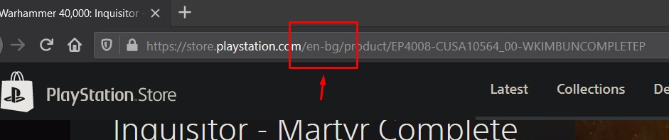
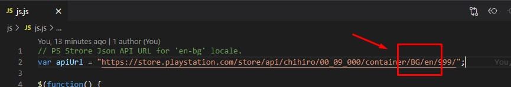
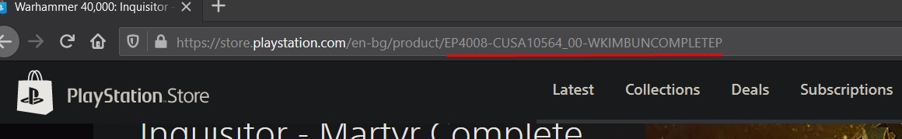

# Wishlist for PlayStation Store
### Add / Remove your desired games to wish list.
***
How this works:
1. Add the files to your web server.
1. Open **js/js.js** and change the locale based on your locale in PlayStation Store.

1. Open the game in store and copy the game ID from the URL. The game ID is the last 37 characters of URL (everything after the last slash).

1. Paste the game ID in the Wishlist form and click "Submit".
1. If you want, you can remove the game from the wishlist by clicking the "Delete" button under the game image.

That's all folks!
***
 :information_source: **Note**: *The game IDs are storred in **data.txt**. You can manually insert/delete game IDs in this file. One ID per line.*

 ***
 